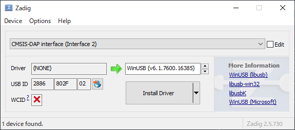
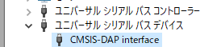
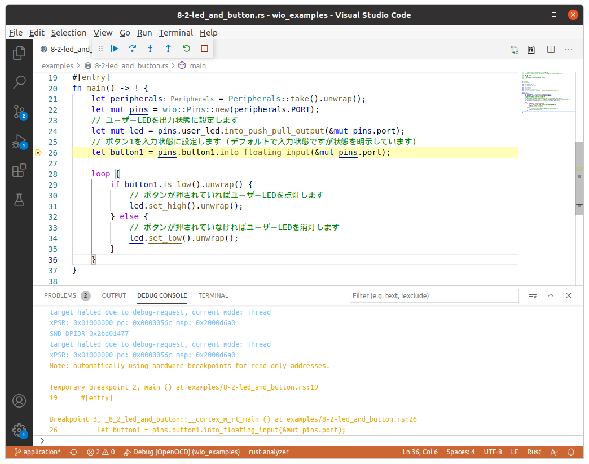

# デバッガを使ったデバッグ

## 概要

書籍内の `Appendix デバッグ` にて紹介している、GDBとOpenOCDをつかってWio Terminal上のプログラムをデバッグするための必要機材や環境構築について説明します。

## 必要機材

必要機材は書籍内でも紹介していますが、それ以外の購入元や、使い方についても補足します。

### Seeeduino XIAO

PCとWio Terminalを接続するために、`Seeeduino XIAO` にDAPLinkファームウェアを書き込んだ物を用います。

Seeeduino XIAO自体は以下の場所から購入出来ます。

| 購入先 | 価格 | リンク | 備考 |
|:-----|:-----|------:|:------|
| 秋月電子通商 | 500円 | https://akizukidenshi.com/catalog/g/gM-15178/ | |
| マルツ | 682円 | https://www.marutsu.co.jp/pc/i/1631560/ | |
| スイッチサイエンス | 594円 | https://www.switch-science.com/catalog/6335/ | |
| 共立エレショップ | 810円 | https://eleshop.jp/shop/g/gK3D313/ |

書籍執筆時点では日本国内での入手性が悪かったため紹介していませんが、現在では秋月電子通商などからヘッダーピン半田付け済みのSeeeduino XIAOが販売されており、
こちらを用いると、後述のジャンパーケーブルに通常のメス-メスのケーブルが使えると言った利点があります。

| 購入先 | 価格 | リンク | 備考 |
|:-----|:-----|------:|:------|
| 秋月電子通商 | 750円 | https://akizukidenshi.com/catalog/g/gM-16135/ | |
| マルツ | 792円 | https://www.marutsu.co.jp/pc/i/2191155/ | |

なお、半田付けが出来る環境であれば、通常の(半田付け済みでない) Seeeduino XIAO自体にピンヘッダが付属しているので、そちらを半田付けして使用できます。

### フレキシブルケーブル(FPC) 変換

Wio Terminalのデバッグ信号は、Wio Terminal内部のボード上のフレキシブルケーブル(FPC)用コネクタに接続されています。
このため、フレキシブルケーブルをデバッグ･アダプタと接続するための変換基板が必要となります。

| 名称 | 購入先 | 価格 | リンク | 備考 |
|:-----|:-----|-----:|:-----|:-----|
| 10ピン 0.5mmピッチ FPC変換基板 FCB05-10PC | aitendo | 450円 | https://www.aitendo.com/product/18491 | |
| 10ピン 0.5mm/1.0mmピッチ 両対応変換基板 | Amazon | 550円 | https://www.amazon.co.jp/gp/product/B07H2FTQJM | |
| 10ピン 0.5mm 変換基板 (L字ピンヘッダ付き) | Amazon | 750円 | https://www.amazon.co.jp/gp/product/B084H9XVND | |

また、Wio Terminalのコネクタと変換基板を接続するためのフレキシブルケーブルも必要です。

| 名称 | 購入先 | 価格 | リンク | 備考 |
|:-----|:-----|-----:|:-----|:-----|
| 10ピン 0.5mmピッチ FPCケーブル FFC0510P-65S (65mm, 同一面) | aitendo | 480円 | https://www.aitendo.com/product/7614 |
| 10ピン 0.5mmピッチ 60mm Aタイプ (10本) | Amazon | 747円 | https://www.amazon.co.jp/gp/product/B07SQ87Z8F |

### ジャンパケーブル

| 名称 | 購入先 | 価格 | リンク | 備考 |
|:-----|:-----|-----:|:-----|:-----|
| コネクタ付きケーブル 20cm 40P メスメス | 秋月電子通商 | 200円 | https://akizukidenshi.com/catalog/g/gC-15868/ | |
| スルーホール用テストワイヤ (10本入り) | 秋月電子通商 | 240円 | https://akizukidenshi.com/catalog/g/gC-09831/ | |

### まとめ

現行でのおすすめの組み合わせは以下の通りです。

#### はんだづけなし (ピン実装済みSeeeduino XIAO使用)

| 機材名 | 必要個数 | 購入先 | 価格 | リンク |
| --- | --- | --- | --- | --- |
| 10ピン 0.5mmピッチ 60mm Aタイプ (10本) | 1セット | Amazon | 747円 | https://www.amazon.co.jp/gp/product/B07SQ87Z8F |
| 10ピン 0.5mm 変換基板 (L字ピンヘッダ付き) | 1個 | Amazon | 750円 | https://www.amazon.co.jp/gp/product/B084H9XVND |
| コネクタ付きケーブル 20cm 40P メスメス | 1個 | 秋月電子通商 | 200円 | https://akizukidenshi.com/catalog/g/gC-15868/ |
| Seeeduino XIAO (半田付け済み) | 1個 | 秋月電子通商 | 750円 | https://akizukidenshi.com/catalog/g/gM-16135/ |

#### はんだづけなし (スルーホール用テストワイヤ使用)

| 機材名 | 必要個数 | 購入先 | 価格 | リンク |
| --- | --- | --- | --- | --- |
| 10ピン 0.5mmピッチ FPCケーブル FFC0510P-65S (65mm, 同一面) | 1個 | aitendo | 480円 | https://www.aitendo.com/product/7614 |
| 10ピン 0.5mmピッチ FPC変換基板 FCB05-10PC | 1個 | aitendo | 450円 | https://www.aitendo.com/product/18491 |
| スルーホール用テストワイヤ (10本入り) | 1セット (要4本) | 秋月電子通商 | 240円 | https://akizukidenshi.com/catalog/g/gC-09831/ |
| Seeeduino XIAO | 1個 | 秋月電子通商 | 500円 | https://akizukidenshi.com/catalog/g/gM-15178/ |

#### はんだづけあり

| 機材名 | 必要個数 | 購入先 | 価格 | リンク |
| --- | --- | --- | --- | --- |
| 10ピン 0.5mmピッチ FPCケーブル FFC0510P-65S (65mm, 同一面) | 1個 | aitendo | 480円 | https://www.aitendo.com/product/7614 |
| 10ピン 0.5mmピッチ FPC変換基板 FCB05-10PC | 1個 | aitendo | 450円 | https://www.aitendo.com/product/18491 |
| コネクタ付きケーブル 20cm 40P メスメス | 1個 | 秋月電子通商 | 200円 | https://akizukidenshi.com/catalog/g/gC-15868/ |
| ピンヘッダ L型 2x40 | 1個 (2x5ピンのみ切り離して使用) | 秋月電子通商 | 100円 | https://akizukidenshi.com/catalog/g/gC-00148/ |
| Seeeduino XIAO | 1個 | 秋月電子通商 | 500円 | https://akizukidenshi.com/catalog/g/gM-15178/ |

Seeeduino XIAOに付属のピンヘッダをSeeeduino XIAOにはんだ付けして、ピンヘッダL型を2x5ピンサイズに切り離してFPC変換基板に半田付けして使います。

## 環境構築

### デバッグアダプタをPCに接続する

デバッグアダプタを使えるようにするために、ドライバのインストールや設定を行います。

#### Windowsの場合

Windowsの場合、OpenOCDが使用する `libusb` からデバイスにアクセスできるようにするため、ドライバのインストールが必要です。ドライバのインストールには `Zadig` というツールを用います。

https://zadig.akeo.ie/ のDownloadリンクからZadigをダウンロードして実行します。次の画面のように、 `CMSIS-DAP interface (interface 2)` が選択されている状態で `Target Driver` の項で `WinUSB` を選択し、`Install Driver` を押します。



ドライバのインストールが成功すると、デバイスマネージャに `CMSIS-DAP interface` として表示されます。



#### Ubuntuの場合

Linuxの場合ドライバは必要ありませんが、一般ユーザーからデバイスを使えるようにするために、 `udev` のルールを追加する必要があります。以下のファイルを `/etc/udev/rules.d/99-xiao-dap.rules` として保存します。

```
KERNEL=="hidraw*", ATTRS{idVendor}=="2886", ATTRS{idProduct}=="802f", MODE="664", GROUP="plugdev"
SUBSYSTEM=="usb", ATTRS{idVendor}=="2886", ATTRS{idProduct}=="802f", MODE="664", GROUP="plugdev"
SUBSYSTEM=="usb_device", ATTRS{idVendor}=="2886", ATTRS{idProduct}=="802f", MODE="664", GROUP="plugdev"
```

その後、 `sudo udevadm control --reload-rules` を実行してから、デバッグアダプタのケーブルを抜いてから挿し直します。

### OpenOCDの準備

OpenOCDは公式のバイナリが用意されておらず、ディストリビューションのパッケージで配布されているものも古い場合が多いので、自前でビルドする必要があります。本書を書くにあたって使用したバイナリをGitHubに置いてありますので、ダウンロードして使えるようにします。
#### Windowsの場合

Windows向けのバイナリを以下のURLからダウンロードします。
https://github.com/ciniml/debug-tools-builder/releases/download/v1.1/openocd-win.zip

コマンドプロンプトでダウンロードしたzipファイルを展開したディレクトリへ移動して、以下のコマンドを実行します。

```
bin/openocd.exe -f interface/cmsis-dap.cfg -f target/atsame5x.cfg
```

実行結果は以下の通りです。

```
> bin/openocd.exe -f interface/cmsis-dap.cfg -f target/atsame5x.cfg
Open On-Chip Debugger 0.11.0-rc2+dev-gf68ade5 (2021-02-12-00:48)
(省略)
Info : Listening on port 3333 for gdb connections
```

OpenOCDを終了するには、`Ctrl+C` を入力してください。後ほどGDBを接続するときは、再度前述のコマンドでOpenOCDを起動します。

#### Ubuntuの場合

Linux向けのバイナリを以下のURLからダウンロードします。
https://github.com/ciniml/debug-tools-builder/releases/download/v1.1/openocd-linux.tar.gz

ダウンロードしたら適当な場所に展開します。以降はホームディレクトリに展開したものとして説明します。

デバッグアダプタをWio Terminalに接続した状態で以下のコマンドを実行して、OpenOCDのデバッグサーバーがで起動できれば成功です。

```
$ ~/openocd-linux/bin/openocd -f interface/cmsis-dap.cfg -f target/atsame5x.cfg
Open On-Chip Debugger 0.11.0-rc2+dev-gf68ade5-dirty (2021-02-08-05:52)
(省略)
Info : Listening on port 3333 for gdb connections
```

OpenOCDを終了するには、`Ctrl+C` を入力してください。後ほどGDBを接続するときは、再度前述のコマンドでOpenOCDを起動します。

### GDBのインストール

Cortex Mのデバッグに使うGDBは、Armのアーキテクチャを対象としたものが必要です。

#### Windowsの場合

Windowsの場合は、Armが公開しているArm用GCCに含まれるGDBを用います。Armの開発者サイトのダウンロードページ (https://developer.arm.com/tools-and-software/open-source-software/developer-tools/gnu-toolchain/gnu-rm/downloads) から `gcc-arm-none-eabi-10-2020-q4-major-win32.zip` をダウンロードし適当な場所に展開します。展開して出てきた `bin` ディレクトリにパスを通しておきます。

#### Ubuntuの場合

Ubuntuの場合は `gdb-multiarch` をインストールするだけです。

```
$ sudo apt install gdb-multiarch
```

### GDBの動作確認

インストールしたGDBを使って、Wio Terminalにアタッチ出来るかどうか確認します。例として本書のサンプルの `6-2-led_and_button.rs` をデバッグしてみます。

本書のサンプルを展開したディレクトリに移動し、サンプルをビルドします。

```
cargo build --example 6-2-led_and_button
```

OpenOCDを実行している状態で、GDBにデバッグ対象のバイナリを指定して起動します。今回の場合は、`6-2-led_and_button`をデバッグするので、 `target/thumbv7em-none-abihf/debug/examples/6-2-led_and_button` を指定します。

###### GDB起動(Windowsの場合)
```sh
> arm-none-eabi-gdb target/thumbv7em-none-eabihf/debug/examples/6-2-led_and_button
--- 省略 ---
Reading symbols from target/thumbv7em-none-eabihf/debug/examples/6-2-led_and_button...
(gdb) 
```

###### GDB起動(Ubuntuの場合)
```sh
$ gdb-multiarch target/thumbv7em-none-eabihf/debug/examples/6-2-led_and_button
--- 省略 ---
Reading symbols from target/thumbv7em-none-eabihf/debug/examples/6-2-led_and_button...
(gdb) 
```
起動すると、`(gdb)` のプロンプトが表示されて入力待ちになりますので、`target remote localhost:3333` を入力します。 

```
(gdb) target remote localhost:3333
Remote debugging using localhost:3333
0x00006fd2 in ?? ()
```

成功すると、GDBが起動中のOpenOCDに接続し、リモートデバッグを行える状態になります。 この状態で `load` コマンドを実行すると、GDB起動時に指定したバイナリがWio Terminalに書き込まれます。

```
(gdb) load
Loading section .vector_table, size 0x264 lma 0x4000
Loading section .text, size 0x21c4 lma 0x4264
Loading section .rodata, size 0x470 lma 0x6428
Start address 0x00004264, load size 10392
Transfer rate: 14 KB/sec, 3464 bytes/write.
```

書き込みが完了したら、`monitor reset halt` を実行してリセット後停止状態にします。 

```
(gdb) monitor reset halt
target halted due to debug-request, current mode: Thread
xPSR: 0x01000000 pc: 0x0000056c msp: 0x2000d6a0
```

`main` 関数にブレークポイントを設定した上で `continue` コマンドで実行を再開します。すぐに`main`関数のブレークポイントで停止します。

```
(gdb) break main
Breakpoint 1 at 0x4a58: file examples/6-2-led_and_button.rs, line 19.
Note: automatically using hardware breakpoints for read-only addresses.
(gdb) continue
Continuing.
Note: automatically using hardware breakpoints for read-only addresses.

Breakpoint 1, main () at examples/6-2-led_and_button.rs:19
19      #[entry]
```

この状態まで確認できれば、あとはGDBを使ってターゲットのデバッグを行うだけです。GDBの使い方はマニュアルなどを参照してください。

### VSCodeのCortex-Debug拡張

VSCodeは元々GDBなどのデバッガと連携してソースレベル･デバッグを行う機能があります。また、`Cortex-Debug` 拡張を使うことにより、OpenOCD + GDBを用いたArm Cortex系CPUのデバッグ環境を使うための設定を簡単に行えます。

Cortex-Debug拡張をVSCodeの拡張機能一覧からインストールします。



拡張をインストールしたら、Cortex-Debugが使うOpenOCDとGDBのパスを設定します。ワークスペースのルートにある`.vscode/settings.json`を開いて以下の項目を追加します。

###### Ubuntuの場合
```json
{
    "cortex-debug.openocdPath": "(openocdのパス)",
    "cortex-debug.gdbPath": "gdb-multiarch"
}
```

###### Windowsの場合
```json
{
    "cortex-debug.openocdPath": "(openocd.exeのパス)",
    "cortex-debug.gdbPath": "(arm-none-eabi-gdb.exeのパス)"
}
```

@div:figure

@divend

設定をしたら`F5`を押してデバッグを開始します。Cortex Debugの設定が正しければ、Wio Terminalにプログラムが書き込まれてmain関数の先頭で停止します。この状態で26行目の左側をクリックしてブレークポイントを設定し、再度`F5`を押すと26行目で停止します。

VSCodeのデバッガ連携機能にはブレークポイント設定以外にも、ステップ実行やウォッチの設定などGDBで行える機能が一通り揃っています。UARTへのデバッグだけでは効率の悪かったデバッグ作業を効率的に行えます。

デバッグ対象のプログラムを変更したい場合は、`.vscode/launch.json`の`executable`で指定しているパスを変更します。

```json
{
    "version": "0.2.0",
    "configurations": [
        {
            /* Configuration for the Wio Terminal */
            "type": "cortex-debug",
            "request": "launch",
            "name": "Debug (OpenOCD)",
            "servertype": "openocd",
            "cwd": "${workspaceRoot}",
            "runToMain": true,
            "executable": "./target/thumbv7em-none-eabihf/debug/examples/6-2-led_and_button",
            "device": "samd51p19a",
            "configFiles": [
                "interface/cmsis-dap.cfg",
                "target/atsame5x.cfg"
            ],
            "svdFile": "./atsamd/svd/ATSAMD51P19A.svd"
        }
    ]
}
```
